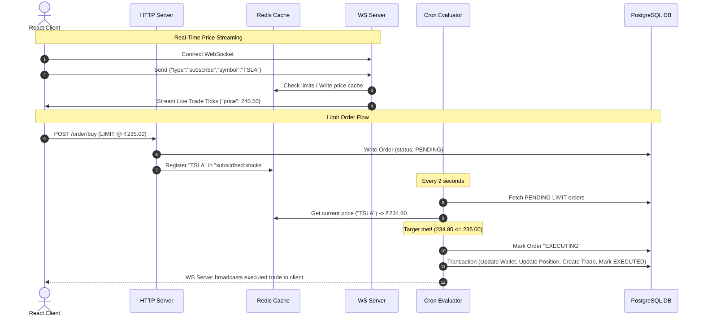

# TradeInCase (Paper Trading Platform)
**Node.js | React | TypeScript | Turborepo | PostgreSQL | Redis | Docker | GitHub Actions**

A high-performance, real-time paper trading system that enables simulated stock trading, updates prices via live WebSockets from Finnhub, caches tickers in Redis, processes limit orders asynchronously via a transaction-safe background cron engine, and provides a social community feed on a sleek React dashboard.

---

## Overview
**TradeInCase** is built as a TypeScript monorepo managed with `pnpm` workspaces and `Turborepo`. The application is architected to handle live market feed streams and execute client stock orders with minimal latency, utilizing a cached Redis registry for active subscriptions and a transaction-safe order execution process.

The platform splits tasks across three principal services:
1. **HTTP Core Server (`apps/http`)**: Manages user authentication (JWT), stock metadata querying, order placement (MARKET and LIMIT), portfolio valuations, and a social community platform. Runs a background `node-cron` daemon checking and executing limit orders every 2 seconds.
2. **WebSocket Ingest Server (`apps/ws`)**: Acts as a stateful client connection manager. Subscribes directly to the Finnhub API's live feed for active tickers, logs incoming price quotes into Redis, and multiplexes trades to connected browser clients over WebSockets.
3. **React Client Dashboard (`apps/web`)**: A responsive single-page web application featuring live price charting (Recharts), dynamic animations (Framer Motion), order execution panels, a social dashboard feed, and historic trade ledgers.

---

## Key Features

* **Monorepo Architecture** — Orchestrated via Turborepo and pnpm workspaces, cleanly separating applications (`http`, `ws`, `web`) and configuration packages (`config`, `ui`, `typescript-config`, `eslint-config`).
* **Real-time Price Stream & Multiplexing** — The WebSocket server manages live subscriptions to Finnhub. It writes incoming tick feeds to a Redis store and broadcasts them in real time to all subscribed front-end client connections.
* **Transactional Limit Order Execution** — A background `node-cron` worker runs every 2 seconds to query pending limit orders, matching them against current prices cached in Redis. Orders are executed within a PostgreSQL database transaction to prevent double-spending and ensure balance consistency.
* **Portfolio & Wallet Ledgering** — Users start with a virtual balance (e.g. ₹10,000 / $10,000). Every buy or sell order updates the User's Wallet balance and maintains an average weighted buy price for their Stock Positions.
* **Social Community Forum** — Integrates a social dashboard where users can share insights, write posts, search by tags, and post comments on other users' thoughts.
* **Beautiful Interactive Charts** — Dynamic stock pages rendering real-time price changes, and historical indicators mapping daily/weekly performance using Recharts and Framer Motion.
* **Production-Grade Infrastructure & CI/CD** — Fully dockerized deployment with Docker Compose, built-in Nginx routing, and a multi-stage GitHub Actions CI/CD pipeline deploying updates to a remote host upon successful builds.

---

## Architecture Flow

```
                                    +-----------------------+
                                    |    Finnhub API WS     |
                                    +-----------+-----------+
                                                |  (Live Ticker Stream)
                                                v
+-------------------+  (Subscribe)  +-----------+-----------+
|                   +-------------->|                       |
|   React Dashboard |               |   WebSocket Server    |
|    (Port 80/80)   |<--------------+     (Port 4000)       |
|                   |  (Live Ticks) |                       |
+--------+----------+               +-----+-----------+-----+
         |                                |           |
         | (HTTP Orders/Auth)             |           | (Write Prices)
         v                                v           v
+--------+----------+               +-----+-----------+-----+
|                   |               |                       |
|    HTTP Server    |               |      Redis Cache      |
|    (Port 3000)    |               |      (Port 6379)      |
|                   |               |                       |
+--------+----------+               +-----------+-----------+
         |                                      ^
         |                                      | (Read Prices & Stocks)
         |                                      v
         |                           +----------+----------+
         | (Database Queries)        |  Limit Order Cron   |
         |                           |   (Every 2 Secs)    |
         |                           +----------+----------+
         v                                      |
+--------+------------------+                   | (Update Executed Trades)
|    PostgreSQL Database    |<------------------+
|      (via Prisma ORM)     |
+---------------------------+
```

### Ingestion & Order Lifecycle
1. **Live Feed Initialization**: When a user views a stock page, the dashboard opens a WebSocket connection to the WS Server (`ws://localhost:4000`) and sends a `subscribe` command for a specific stock symbol (e.g., `AAPL`).
2. **Subscription Multiplexing**: The WS Server adds the socket connection to its local symbol map. If the symbol isn't already active on the Finnhub feed, it sends a subscription message to Finnhub.
3. **Cache & Broadcast**: As Finnhub sends live trade ticks, the WS Server updates the Redis cache (`price:${SYMBOL}`) and forwards the payload to all client web browsers subscribed to that symbol.
4. **Order Placement**: 
   - **Market Order**: The user places a market order. The HTTP server queries the live price from Yahoo/Finnhub, checks user wallet balance, updates the user's cash, logs the trade, adjusts stock positions, and returns the receipt.
   - **Limit Order**: The user sets a target limit price. The HTTP server creates a `PENDING` order record and registers the symbol in the Redis `"subscribed:stocks"` set.
5. **Asynchronous Cron Execution**: Every 2 seconds, the HTTP server's limit-order cron sweeps all `PENDING` limit orders. It checks the live price for each symbol in Redis. If target conditions are met, it claims the order by marking it `EXECUTING`, executes the transaction (wallet balance transfer + position adjustments), logs a `Trade` record, and marks the order `EXECUTED`.

---

## Tech Stack

| Layer | Technology | Version | Purpose |
| :--- | :--- | :--- | :--- |
| **Runtime & Language** | Node.js, TypeScript | v20, v5.9.3 | Execution environment and type-safe server logic |
| **Monorepo Build** | Turborepo, pnpm | v2.5.8, v9.0.0 | Monorepo pipeline orchestrator and workspace manager |
| **Backend Framework** | Express, ts-node | v5.1.0, v10.9.2 | Core HTTP JSON routing and runtime compiler |
| **Stateful Server** | ws | v8.18.3 | Custom high-performance WebSocket client-subscriber gateway |
| **Database & ORM** | PostgreSQL, Prisma | v6.18.0 | Relational database schema execution and Object Relational Mapping |
| **Caching Store** | Redis (ioredis) | v5.8.2 | Shared pricing cache and active stock subscription buffer |
| **Frontend UI** | React, Vite | v19.1.1, v7.1.7 | Reactive SPA architecture and fast bundling |
| **Styling & Icons** | Tailwind CSS, Lucide | v3.4.18, v0.548.0 | Utility-first CSS layout styling and vector icon kit |
| **Visual Charting** | Recharts, Framer Motion | v3.4.1, v12.24.0 | Time-series charting and micro-animations |
| **CI/CD Pipeline** | GitHub Actions | - | Automated build workflows on branch changes and VM deployments |
| **Containerization** | Docker, Nginx | v1.25+ | Container isolation and reverse-proxy deployment |

---

## Project Structure

```
paper_trading/
├── docker-compose.yml         # Dev multi-container setup (redis, http, ws, web)
├── docker-compose_prod.yml    # Production-ready multi-container configuration
├── package.json               # Root workspace manifest
├── pnpm-workspace.yaml        # Workspace packaging config (apps & packages)
├── tsconfig.base.json         # Shares typescript compiler properties
├── turbo.json                 # Turborepo task dependencies pipeline
│
├── apps/
│   ├── http/                  # Main Express API, cron worker & DB schema
│   │   ├── prisma/            # Prisma schema models & migrations
│   │   │   └── schema.prisma
│   │   ├── src/
│   │   │   ├── controller/    # Route controllers (auth, order, post, stock, user)
│   │   │   ├── cron/          # limitOrderCron evaluation worker (every 2s)
│   │   │   ├── lib/           # Prisma client initialization wrapper
│   │   │   ├── middleware/    # JWT authorization validator
│   │   │   ├── routes/        # App endpoints mappings
│   │   │   ├── services/      # Stock creation logic
│   │   │   ├── utils/         # Yahoo / Finnhub external price interfaces
│   │   │   ├── redis.ts       # ioredis instantiation client
│   │   │   └── index.ts       # Server bootstrap script
│   │   └── Dockerfile         # Docker multi-stage environment for HTTP build
│   │
│   ├── ws/                    # WebSocket Connection Manager Server
│   │   ├── src/
│   │   │   ├── connectionManager.ts # Handles client subs, unsubscribes and ticks
│   │   │   ├── finnhubClient.ts     # Connected socket to Finnhub live API
│   │   │   ├── redis.ts             # Redis reference for caching incoming ticks
│   │   │   └── index.ts             # WS server launch script
│   │   └── Dockerfile         # Docker image building setup for WS server
│   │
│   └── web/                   # Vite + React Client Dashboard SPA
│       ├── src/
│       │   ├── components/    # Common UI widgets (Navbar, buttons, loaders)
│       │   ├── pages/         # Platform pages (Landing, Portfolio, Stock, Home Feed)
│       │   ├── services/      # Axios hooks targeting the API
│       │   ├── App.tsx        # Main router setup
│       │   └── index.css      # Custom Tailwind styling variables
│       ├── Dockerfile         # Nginx static wrapper for Vite builds
│       └── nginx.conf         # Custom Nginx proxy configuration
│
└── packages/                  # Shareable local packages
    ├── config/                # Common environment definitions
    ├── eslint-config/         # Project-wide lint configurations
    ├── typescript-config/     # Base tsconfigs for apps
    └── ui/                    # Reusable, pure components (button, card, etc.)
```

---

## Getting Started

### Prerequisites
* **Node.js**: v20 or higher
* **pnpm**: v9.0.0 or higher
* **Docker & Docker Compose** (required for containerized services)
* **PostgreSQL & Redis**: (Optional if running services bare-metal without Docker)

### Local Development Setup

1. **Clone the Repository**
   ```bash
   git clone https://github.com/Atithi2908/Backend_monitoring_system.git
   cd Backend_monitoring_system
   ```

2. **Install Monorepo Workspace Dependencies**
   ```bash
   pnpm install
   ```

3. **Configure Environment Variables**
   Create a `.env` file in the root directory and/or in specific service folders matching the values below:

   **In `apps/http/.env`**:
   ```env
   DATABASE_URL="postgresql://<user>:<password>@localhost:5432/<db_name>?schema=public"
   JWT_SECRET="your-jwt-secret-string"
   FINNHUB_API_KEY="your-finnhub-api-key"
   REDIS_URL="redis://localhost:6379"
   ```

   **In `apps/ws/.env`**:
   ```env
   FINNHUB_API_KEY="your-finnhub-api-key"
   REDIS_URL="redis://localhost:6379"
   ```

   **In `apps/web/.env`**:
   ```env
   VITE_API_BASE_URL="http://localhost:3000"
   ```

4. **Initialize the Database Schema**
   Ensure PostgreSQL is running, then apply the migrations and generate the client:
   ```bash
   pnpm --filter http exec prisma migrate dev --config apps/http/prisma.config.ts
   ```

5. **Start Dev Servers**
   Spin up Redis via Docker Compose:
   ```bash
   docker compose up -d redis
   ```
   Start the Turborepo development environment running HTTP, WS, and Web apps concurrently:
   ```bash
   pnpm dev
   ```
   - **HTTP Server**: Runs on [http://localhost:3000](http://localhost:3000)
   - **WebSocket Server**: Runs on `ws://localhost:4000`
   - **React Dashboard**: Runs on [http://localhost:5173](http://localhost:5173)

---

## API Reference

### HTTP API Endpoints

| Method | Endpoint | Auth | Description |
| :--- | :--- | :--- | :--- |
| **POST** | `/user/signup` | None | Register a new user and initialize Wallet with ₹10,000 |
| **POST** | `/user/login` | None | Verify user credentials and return a session JWT |
| **GET** | `/user/getDetails` | JWT | Fetch current user info (ID, name) and Wallet balance |
| **GET** | `/user/portfolio` | JWT | Fetch active positions (symbols, quantities, avg buy price) |
| **GET** | `/user/orders` | JWT | Fetch order history logs including execution status |
| **GET** | `/user/trades` | JWT | Fetch exact transaction trade logs |
| **POST** | `/order/buy` | JWT | Place a stock order (Market executed or Limit registered) |
| **POST** | `/stock/entry` | JWT | Ensure a stock is created in database registry |
| **GET** | `/stock/:symbol/quote` | JWT | Fetch live ticker quote directly from Finnhub |
| **GET** | `/stock/:symbol/info` | JWT | Fetch detailed stock profiles (fallback to Yahoo charts) |
| **GET** | `/stock/:symbol/getStockChartData` | JWT | Retrieve historical OHLCV chart ticks from Yahoo Finance |
| **GET** | `/stock/search` | None | Query stock suggestions using Finnhub search indexes |
| **POST** | `/post/create` | JWT | Write a community insight post |
| **POST** | `/post/comment` | JWT | Write a comments response to a community post |
| **GET** | `/post/fetchPost` | JWT | Fetch all insight posts sorted by creation date |
| **GET** | `/post/fetchComment` | JWT | Fetch all comments associated with a specific postId |

### WebSocket Protocol

The dashboard connects to `ws://localhost:4000` to stream prices.

#### 1. Subscribe to Live Quotes
```json
{
  "type": "subscribe",
  "symbol": "AAPL"
}
```
*Subscribes client to ticker feed; registers the symbol in Redis so the WS gateway updates from Finnhub.*

#### 2. Unsubscribe from Ticker
```json
{
  "type": "unsubscribe",
  "symbol": "AAPL"
}
```
*Removes the client subscriber from the tick pool.*

#### 3. Inbound Live Trade Tick
```json
{
  "type": "trade",
  "symbol": "AAPL",
  "data": [
    { "p": 178.45, "s": "AAPL", "t": 1693457291000, "v": 100 }
  ]
}
```
*Streamed price ticks containing price (`p`), symbol (`s`), timestamp (`t`), and volume (`v`).*

---

## How It Works



---

## Deployment

### Local Docker Compose Orchestration
Spin up the complete multi-container setup (web proxy, express application, WebSocket gateway, and Redis cache):
```bash
docker compose up --build -d
```
The application components will be mapped to:
- **Client Frontend UI**: [http://localhost](http://localhost) (Nginx proxy, port 80)
- **API routes**: Calls are routed to port `3000`
- **WS Server**: Ports are routed to port `4000`

### Production Deployment
In staging/production, the application is deployed under `docker-compose_prod.yml` and routed through standard SSL proxies using:
```bash
docker compose -f docker-compose_prod.yml up -d
```
All API bases configure to the domain `tradeincase.mooo.com` using secure standard HTTPS (`https://`) and WebSocket Secure (`wss://`) routing.

### CI/CD Deployment via GitHub Actions
The workspace uses GitHub Actions for continuous integration and delivery:
* **CI Workflow (`ci.yml`)**: Triggered on every pull request and push to the `main` branch. It checks types, sets up workspace packages, installs caching, and builds all project assets.
* **CD Workflow (`cd.yml`)**: Initiated on successful CI completion. Logs into the host VM target over SSH, pulls the main branch changes, builds Docker images using production environments, and restarts the Docker containers.